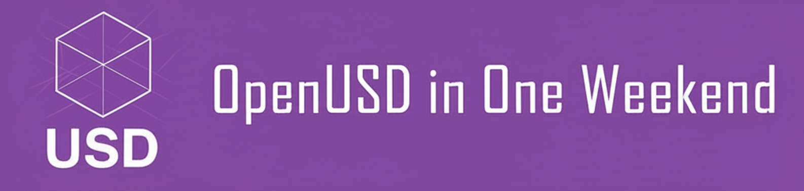

 # OpenUSD in One Weekend

  

Welcome to **OpenUSD in One Weekend** — your gateway to mastering Universal Scene Description (USD), the industry-standard framework revolutionizing 3D content creation and collaboration.

## What You'll Learn

This book series is designed as a practical, weekend-intensive journey through OpenUSD. Whether you're a 3D artist, technical director, software developer, or curious enthusiast, you'll gain hands-on experience with:

- **Core USD Concepts**: Stages, layers, prims, and the fundamental building blocks of USD scenes
- **Python Scripting**: Programmatic creation and manipulation of USD files using Python APIs
- **Asset Management**: Building modular, reusable 3D assets and complex scene hierarchies
- **Animation & Dynamics**: Creating time-varying data, animations, and physics simulations
- **Advanced Workflows**: Multi-layered compositions, variants, and collaborative pipelines
- **Real-World Applications**: From digital twins to metaverse content creation

This book focuses on **Python scripting** with OpenUSD rather than GUI-based workflows. You'll learn to harness the full programmatic power of USD, enabling automation, customization, and scalable 3D production pipelines.

## Accessibility & Platform Support

  
  
  

This book is designed to be accessible and inclusive for learners at all levels:

- **Plain-language explanations** with step-by-step guidance
- **Screen-reader friendly** structure with semantic headings and alt text
- **Copy-pasteable code** and fully runnable scripts
- **Minimal setup** using `pip` or `conda` or `Python in Blender`; no proprietary tools required
- **Cross-platform parity**: the same exercises and scripts work on all major OSes

## Why OpenUSD Matters

OpenUSD isn't just another 3D file format — it's a comprehensive ecosystem designed for the future of 3D content. Originally developed by Pixar and now stewarded by the Alliance for OpenUSD (AOUSD), USD has become the foundation for:

- **Film & Animation**: Major studios use USD for complex production pipelines
- **Games & Interactive Media**: Real-time engines leverage USD for asset streaming
- **Industrial Metaverse**: Manufacturing and simulation workflows built on USD
- **AI & Machine Learning**: Training datasets and synthetic content generation

## Book Structure

This series is organized as a progressive weekend learning experience:

**Before We Begin** 🎨
: Get inspired by Andy's artistic USD creations, understand the USD ecosystem, and set up your development environment

**Day One** ⚡
: Master the fundamentals — create your first USD files, understand scene composition, and build reusable assets

**Day Two** 🚀  
: Dive into advanced topics — animation, physics simulation, complex scene assembly, and optimization techniques

**After the Weekend** 🌟
: Explore cutting-edge applications, integration with modern tools, and prepare for production workflows

## Who This Book Is For

- **3D Artists** transitioning to code-driven workflows
- **Technical Directors** building USD-based pipelines  
- **Software Developers** entering the 3D graphics domain
- **Researchers** working with synthetic datasets and simulations
- **Students** learning modern 3D content creation technologies

## Prerequisites

- Basic Python programming knowledge
- Familiarity with 3D concepts (geometry, transformations, materials)
- Willingness to learn through hands-on coding

Tested on recent versions of macOS, Ubuntu/Debian-based Linux distributions, and Windows 10/11.

Ready to transform your weekend into a USD mastery journey? Let's begin!
